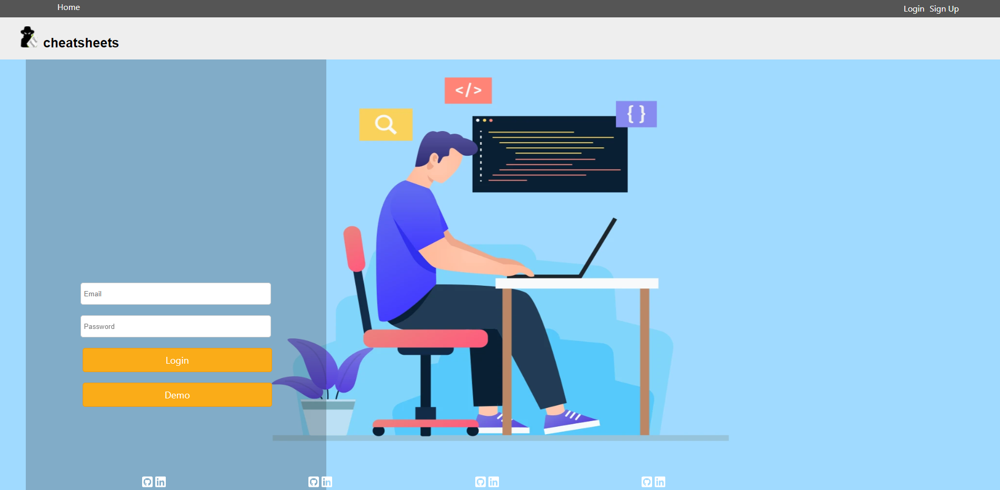
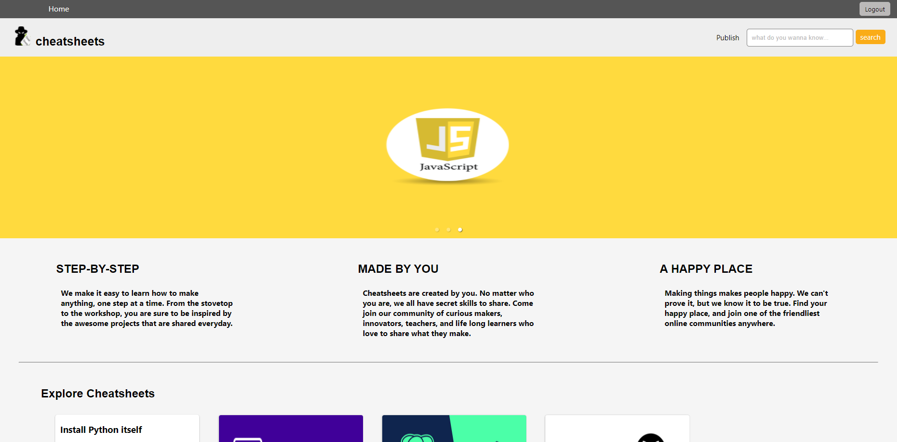
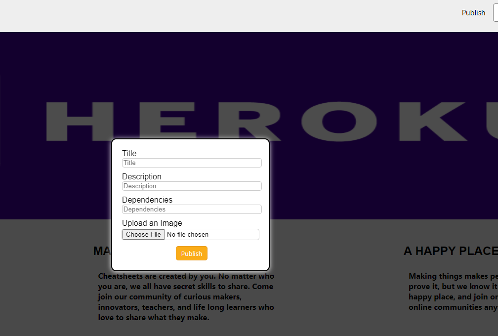
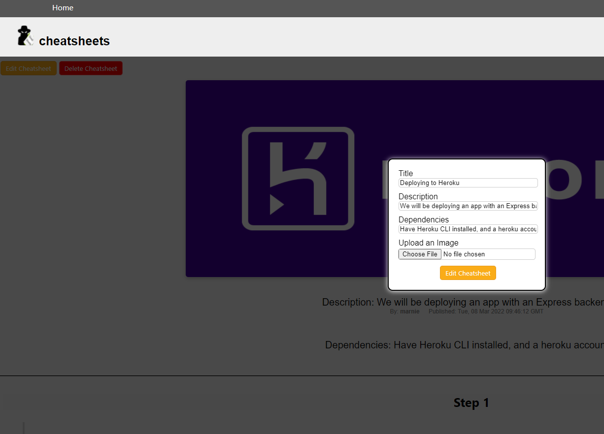
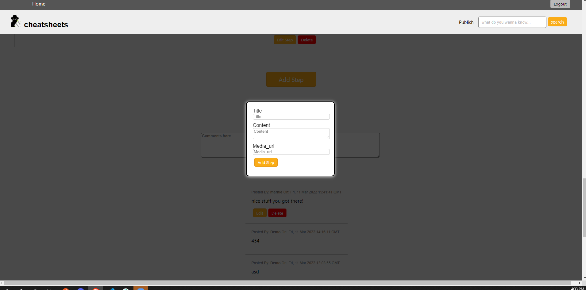
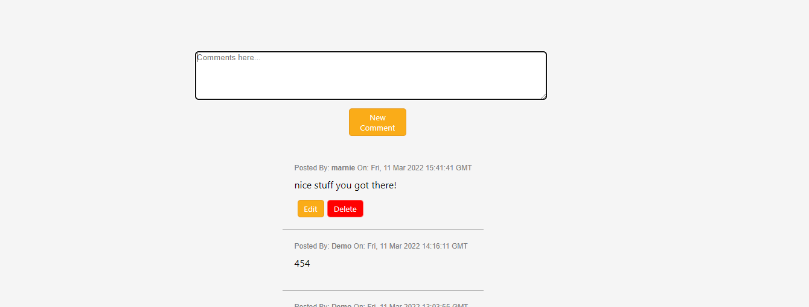
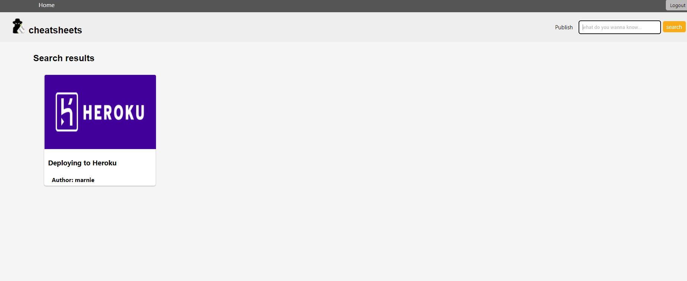

# Cheatsheets Python Project

## Live Site
[Cheatsheets](https://cheatsheets-group-project.herokuapp.com/) was inspired by [instructables](https://www.instructables.com/) which is a platform for creating step-by-step instructions on how to create things.

## Technologies Used
Javascript | Python | Node.js | Flask | React | Redux | SQLAlchemy | PostgreSQL

## Getting started

1. Clone this repository (main branch)

   ```bash
   git clone https://github.com/mdepree5/cheatsheets.git
   ```

2. Install backend dependencies

      ```bash
      pipenv install --dev -r dev-requirements.txt && pipenv install -r requirements.txt
      ```


3. Setup your PostgreSQL user, password and database and make sure it matches your **.env** file
   ```
   psql -c "CREATE USER <username> WITH PASSWORD '<password>' CREATEDB"
   psql -c "CREATE DATABASE <databasename> WITH OWNER '<username>'"
   ```

4. Create a **.env** file based on the example with proper settings for your
   development environment

5. Get into your pipenv, migrate your database, seed your database, and run your flask app

   ```bash
   pipenv shell
   ```

   ```bash
   flask db upgrade
   ```

   ```bash
   flask seed all
   ```

   ```bash
   flask run
   ```

6. Install frontend dependencies in react-app directory
   ```
   cd ./react-app
   npm install
   ```

7. To run the React App in development run ```npm start``` from ```react-app``` directory
   ```
   cd ./react-app
   npm start
   ```

# Cheatsheets quick overview

## splashpage/Login page









